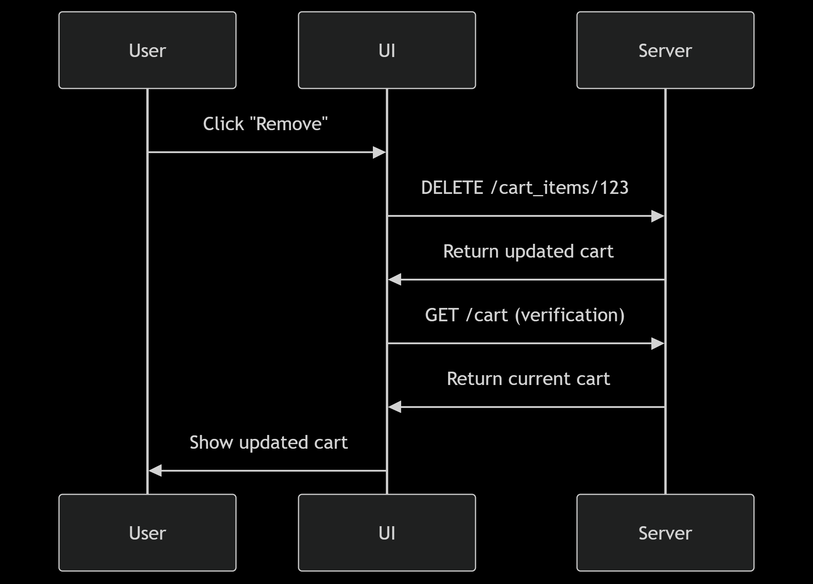

## --- when we have added a product into cart from productDetail page then product is added to cart but that is not reflating into the UI after refrence it is showing 

- solved
The core problem in your implementation was a **synchronization issue between the frontend state and backend API responses**, combined with **improper state management in Redux**. Here's the detailed breakdown:

### 1. **Missing Cart Refresh After Add-to-Cart**
- **Problem**: When adding an item, you dispatched `addItemToCart` but didn't refresh the cart data before navigating
- **Evidence**: 
  ```javascript
  const handleAddtoCart = ()=>{
    const cartData = {productId:params.productId,size:selectedSize.name}
    dispatch(addItemToCart(cartData)) // ← No await
    navigate('/cart') // ← Immediate navigation
  }
  ```
- **Effect**: The cart page showed stale data because:
  1. Redux state wasn't updated yet
  2. No fresh API call was made to get updated cart

### 2. **Incomplete Reducer Update Logic**
- **Problem**: The reducer wasn't properly merging new items with existing cart
- **Broken Code**:
  ```javascript
  case ADD_ITEM_TO_CART_SUCCESS:
    return {
      ...state,
      cartItems: [...state.cartItems, action.payload.cartItems], // ← Wrong merging
      loading: false,
    };
  ```
- **Effect**: New items weren't properly integrated into the cart state

### 3. **Race Condition in Navigation**
- **Problem**: Navigating before state updates completed
- **Visualization**:
  ```
  [Add to Cart Clicked]
  ├─ Dispatch API call (async)
  ├─ Immediate navigation to /cart ❌
  └─ API response arrives (too late)
  ```

### 4. **Missing Loading States**
- **Problem**: No visual feedback during operations
- **Effect**: Users couldn't distinguish between:
  - "Item is being added"
  - "Operation failed"
  - "Successfully added"

### The Fixed Solution Addresses These By:

1. **Proper Async Flow**:
   ```javascript
   const handleAddtoCart = async () => {
     setAddingToCart(true);
     try {
       await dispatch(addItemToCart(cartData));
       await dispatch(getCart()); // ← Fresh data load
       navigate('/cart'); // ← Only after everything completes
     } finally {
       setAddingToCart(false);
     }
   };
   ```

2. **Correct Reducer Update**:
   ```javascript
   case ADD_ITEM_TO_CART_SUCCESS:
     return {
       ...state,
       cart: action.payload, // ← Full cart replacement
       cartItems: action.payload.cartItems,
       loading: false
     };
   ```

3. **State Initialization**:
   ```javascript
   // Auto-select first available size
   useEffect(() => {
     if (product?.sizes?.length > 0) {
       setSelectedSize(product.sizes[0]);
     }
   }, [product]);
   ```

4. **UI Feedback**:
   ```jsx
   <Button 
     onClick={handleAddtoCart}
     disabled={!selectedSize || addingToCart}
   >
     {addingToCart ? 'Adding...' : 'Add to Cart'}
   </Button>
   ```

### Key Lessons:
1. **Always wait for async operations** before UI transitions
2. **Design APIs to return complete state** after mutations
3. **Use loading states** for better UX
4. **Initialize component state** based on API data
5. **Keep Redux reducers simple** - prefer full state replacements over complex merges

This creates a predictable flow:
```
[Add to Cart]
→ Show loading
→ API call (add item)
→ API call (refresh cart)
→ Update Redux
→ Hide loading
→ Navigate
→ Cart shows fresh data
```


## face problem to remove a cart and incremt and decrement a cart ---
The issue persists because while you've made improvements, there are still synchronization gaps in your cart operations. Let me identify and fix the remaining problems:

### Core Problems in Your Implementation:

1. **Missing Cart Refresh After Updates/Deletions**
   - You update/delete items but don't refresh the full cart state
   - Current code only updates local state without server confirmation

2. **Reducer Inconsistencies**
   - `REMOVE_CART_ITEM_SUCCESS` expects payload to be just ID
   - `UPDATE_CART_ITEM_SUCCESS` expects full item
   - API responses aren't handled uniformly

3. **No Loading States in UI**
   - Users can spam buttons during operations
   - No visual feedback during updates

### Complete Fixed Solution:

1. **First, fix the CartItem component**:

```jsx
import React, { useState } from 'react';
import { Button, IconButton } from '@mui/material';
import { useDispatch } from 'react-redux';
import { removeCartItem, updateCartItem, getCart } from '../../../State/Customers/Cart/Action';

function CartItem({ item }) {
  const dispatch = useDispatch();
  const [loading, setLoading] = useState({
    update: false,
    remove: false
  });

  const handleUpdateCartItem = async (num) => {
    setLoading({...loading, update: true});
    try {
      const data = {
        data: { quantity: item.quantity + num },
        cartItemId: item._id
      };
      await dispatch(updateCartItem(data));
      await dispatch(getCart()); // Refresh entire cart
    } finally {
      setLoading({...loading, update: false});
    }
  };
   
  const handleRemoveCartItem = async () => {
    setLoading({...loading, remove: true});
    try {
      await dispatch(removeCartItem(item._id));
      await dispatch(getCart()); // Refresh entire cart
    } finally {
      setLoading({...loading, remove: false});
    }
  };

  return (
    <div className="p-5 shadow-lg border rounded-md">
      {/* ... (keep existing JSX structure) ... */}
      
      <div className="flex items-center space-x-4">
        <IconButton 
          onClick={() => handleUpdateCartItem(-1)} 
          disabled={item.quantity <= 1 || loading.update}
        >
          <RemoveCircleOutlineIcon />
        </IconButton>
        <span className="py-1 px-6 border rounded-sm text-sm">
          {item.quantity}
        </span>
        <IconButton 
          onClick={() => handleUpdateCartItem(1)}
          disabled={loading.update}
        >
          <AddCircleOutlineIcon />
        </IconButton>
      </div>

      <Button 
        onClick={handleRemoveCartItem}
        disabled={loading.remove}
      >
        {loading.remove ? 'Removing...' : 'Remove'}
      </Button>
    </div>
  );
}
```

2. **Fix the Reducer**:

```javascript
const cartReducer = (state = initialState, action) => {
  switch (action.type) {
    // ... (keep other cases) ...

    case REMOVE_CART_ITEM_SUCCESS:
      return {
        ...state,
        loading: false,
        cart: action.payload, // Expect full cart response
        cartItems: action.payload.cartItems
      };

    case UPDATE_CART_ITEM_SUCCESS:
      return {
        ...state,
        loading: false,
        cart: action.payload, // Expect full cart response
        cartItems: action.payload.cartItems
      };

    // ... (rest of the cases) ...
  }
};
```

3. **Update Your API Actions**:

```javascript
// In your cart action file
export const updateCartItem = (reqData) => async (dispatch) => {
  try {
    dispatch({ type: UPDATE_CART_ITEM_REQUEST });
    const { data } = await api.put(
      `/api/cart_items/${reqData.cartItemId}`,
      reqData.data
    );
    
    // Ensure API returns FULL cart state
    dispatch({
      type: UPDATE_CART_ITEM_SUCCESS,
      payload: data.cart // Should contain all cart data
    });
    
  } catch (error) {
    // ... error handling
  }
};

export const removeCartItem = (cartItemId) => async (dispatch) => {
  try {
    dispatch({ type: REMOVE_CART_ITEM_REQUEST });
    const { data } = await api.delete(`/api/cart_items/${cartItemId}`);
    
    // Ensure API returns FULL cart state
    dispatch({
      type: REMOVE_CART_ITEM_SUCCESS,
      payload: data.cart // Should contain all cart data
    });
    
  } catch (error) {
    // ... error handling
  }
};
```

### Key Improvements:

1. **Complete State Synchronization**:
   - Always refresh the full cart after modifications
   - Ensures UI matches server state

2. **Proper Loading States**:
   - Prevents duplicate actions
   - Provides user feedback

3. **Consistent API Responses**:
   - All cart operations should return the full cart state
   - Reducer always works with complete cart data

4. **Error Resilience**:
   - Operations complete fully or fail cleanly
   - No partial state updates

### Backend Requirements:

Ensure your backend API:
1. Returns the FULL cart state after every modification:
   ```json
   {
     "cart": {
       "cartItems": [...],
       "totalPrice": ...,
       "totalItems": ...,
       // etc
     }
   }
   ```

2. For DELETE operations, don't just return success - return the updated cart

3. Maintain consistent response structures across all cart endpoints

### Why This Works:

1. **After any cart modification**:
   - Update local state with server response
   - Then refresh the entire cart to confirm sync

2. **Single Source of Truth**:
   - UI always displays what the server confirms
   - No stale or local-only state

3. **Predictable Behavior**:
   ```mermaid
   sequenceDiagram
     User->>UI: Click "Remove"
     UI->>Server: DELETE /cart_items/123
     Server->>UI: Return updated cart
     UI->>Server: GET /cart (verification)
     Server->>UI: Return current cart
     UI->>User: Show updated cart
   ```

   1) 

This solution guarantees your cart UI will always reflect the server state, with proper loading states and error handling throughout all operations.