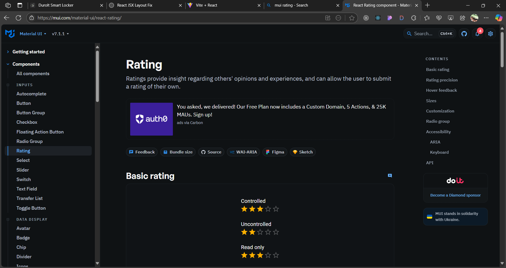
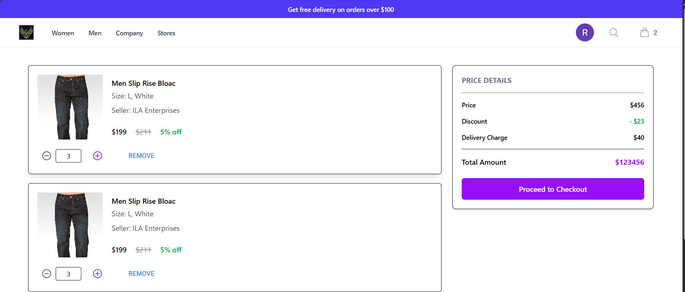

1) npx create vite@latest
2) to install the dependecies of MUI: npm install @mui/material @emotion/react @emotion/styled
3) to install the material UI icon: npm install @mui/icons-material @mui/material @emotion/styled @emotion/react
4) install the tailwings 
## ----------  how to install the tailwings css for create-react-app ------------ 
To install **Tailwind CSS** in a project created using `npx create vite@latest`, follow these steps:
1) go to website of tailwings and follow the inctruction to donwload it
### ---------------- 

5) to create store navigation use the tailwings css:
6) for that generate code from there it-selph:  and paste the code in Navigation.jsx component.
7) 
8) we will get two errors:

The error you're seeing:

```
Module not found: Can't resolve '@headlessui/react'
```

means that the dependency `@headlessui/react` is **not installed**, but it is being **imported and used** in your code (likely in `Navigation.jsx`).

---

### ✅ Fix: Install the Missing Package

Run this command in your project root:

```bash
npm install @headlessui/react
```

This will install the required package.

After it's installed, try running the app again:

```bash
npm start
```

---

### 🧠 Why This Happens

* `@headlessui/react` is a library used with Tailwind CSS for accessible UI components like modals, dropdowns, and more.
* It must be explicitly installed if your component relies on it.

Let me know if you also need to install `@heroicons/react` (often used with `@headlessui/react`). If yes, run:

```bash
npm install @heroicons/react
```

The new error:

```
Module not found: Can't resolve '@heroicons/react/24/outline'
```

means that the **Heroicons** package is not installed in your project, and you're trying to use icons like this in `Navigation.jsx`:

```js
import { Bars3Icon, XMarkIcon } from '@heroicons/react/24/outline'
```

---

### ✅ Fix: Install `@heroicons/react`

Run this command in your project root:

```bash
npm install @heroicons/react
```

Once it's done, run your app again:

```bash
npm start
```

---

### 📦 What Is `@heroicons/react`?

It provides free, beautifully designed SVG icons from the Tailwind CSS team. The path `/24/outline` refers to the 24-pixel outline style icons.

---

8) npm i react-alice-carousel
9) now we have to implement the react-alice-carousel for that go to there website and select one carousel: https://maxmarinich.github.io/react-alice-carousel/#basic
10) 
11) now home page carousel is Done.
12) 
## ---- completed upto card 
13) current output 
14) 
15) 

## part-2: 1:35:00 hours...

1) working with footer and navbar
2) completing the footer nad navbar section 
3) output 
4) 
5) 
6) ## -------- working with Product Page -------
7) get the tailwing css component template for creating the Product page
8) 
9) paste that code to product.jsx to create it and modify it also.
10) 
11) now appying the filter feacture on the url for that we will create two handler for that we have to use useLocation() hook which is avaialble in react-router not in react so we need to install the rect-router as well: npm install react-router-dom 
    - handlerFilter
    - handleSingleFilter
12) output is 
13) 
## ----------------- end ------------------
## ------------ Part -3: creating product details page ------------------

 
1) 
2) we are using the material-ui-rating:
3) 
4) 

## ------- branch-5-creating-product-cart-page working with checkout page --------

1) 

## ------- branch-6- creating checkout-page
1) to create the stepper component we are using the material UI stepper component
2) 
3) 


## ------- working with redux  --------------


## ------ branch-10 working with product,cart and implemention of product page to implement the backend apis using redux -------
1) first create the folder in state folder as customers/Product
2) second create three files 
    - ActionTypes.js
    - Action.js
    - Reducer.js
3) so first we need to define the ActionTypes, then Actions then Reducers
4) 


